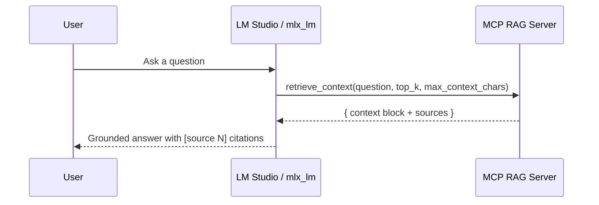

# Advanced MCP RAG Server (Clientless)

A compact, strict MCP server for **retrieval only**. It exposes tools for search, fetch, chunking, embeddings, and vector search (Chroma). **No LLM client is embedded**—your LM Studio or `mlx_lm` model calls the tools and writes the final answer.

> Mental model: the MCP server builds a grounded context; your chat model uses it.

---

## Why this design?

- **Separation of concerns**: MCP handles retrieval; the chat model handles writing.  
- **Predictable speed**: local embeddings (SentenceTransformers) + persistent Chroma index.  
- **Portable**: works with LM Studio or `mlx_lm` using MCP tool calls.

---

## Call flow (clientless)



---

## Features

- DuckDuckGo search (no API key), clean HTML via BeautifulSoup
- SSRF guards, timeouts, response size caps, shared `httpx` client
- Chunking (word-wise with overlap), SentenceTransformers embeddings
- Chroma persistent vector store
- `retrieve_context` packs a single, citation-ready context block with a source map
- Strict: **no fallbacks**, fail fast with clear errors

---

## Requirements

- Python **3.10+** (recommended)
- Packages:
  ```bash
  pip install mcp[cli] httpx beautifulsoup4 chromadb sentence-transformers torch
  ```

> On Apple Silicon, `torch` with Metal/MPS helps but isn’t required for embeddings.

---

## Install & Run

```bash
# run the server
python rag_web_mcp.py
```

Your MCP client (LM Studio, Jan, etc.) connects over stdio.

---

## Configuration

Environment variables (all optional):

| Variable              | Default                                       | Purpose |
|----------------------|-----------------------------------------------|---------|
| `MCP_DB_PATH`         | `./chroma_db`                                 | Chroma persistence path |
| `MCP_COLLECTION`      | `documents`                                   | Chroma collection name |
| `MCP_EMBED_MODEL`     | `sentence-transformers/all-mpnet-base-v2`     | Embedding model id |
| `MCP_CHUNK_SIZE`      | `180`                                         | Approx words per chunk |
| `MCP_CHUNK_OVERLAP`   | `40`                                          | Words of overlap between chunks |
| `MCP_MAX_CONCURRENCY` | `4`                                           | Parallel fetch/ingest limit |
| `MCP_FETCH_MAX_BYTES` | `5_000_000`                                   | Max page size accepted |
| `MCP_USER_AGENT`      | `AdvancedMCP-RAG/1.0 (+https://example.local)`| HTTP UA string |

---

## Tools (MCP)

| Tool | Description |
|------|-------------|
| `web_search(query, limit=5)` | DuckDuckGo HTML search → `[{title, url}]` |
| `fetch_page(url)` | Safe fetch & clean → `{ok, url, status, title, text, error?}` |
| `ingest_url(doc_id, url, replace=False)` | Fetch, chunk, embed, upsert into Chroma |
| `add_document(doc_id, content, url?, title?)` | Ingest raw text with optional metadata |
| `search_and_ingest(query, limit=3)` | Search, then ingest each result |
| `query_knowledge_base(query, top_k=3)` | Vector search → `[{id, text, score, meta}]` |
| `summarize_document(doc_id, n_sentences=3)` | First‑N sentence summary of a chunk |
| `list_documents(offset=0, limit=100)` | Paginated list of chunk IDs |
| `delete_document(doc_id)` | Delete a single chunk by id |
| `delete_by_url(url)` | Delete all chunks tagged with that URL |
| **`retrieve_context(question, top_k=5, max_context_chars=3000)`** | Builds a single **Sources + Context Passages** block and a structured `sources` array |

**Dedup**: Ingestion checks a document‑level checksum; exact duplicates are skipped.

---

## Using it with LM Studio / `mlx_lm`

**Recommended system prompt:**

> You have a tool `retrieve_context(question, top_k, max_context_chars)`.
> For any question requiring external knowledge, call the tool first.
> Then answer **only** using the information in `<context>`.
> Cite sources inline as `[source N]`, where `N` matches the Sources list.
> If the answer isn’t present in the context, say you don’t know.

**Typical tool call:**
```json
{
  "tool_name": "retrieve_context",
  "arguments": {
    "question": "What is the Python event loop?",
    "top_k": 5,
    "max_context_chars": 3000
  }
}
```

**Response shape:**
```json
{
  "ok": true,
  "context": "Sources:\n[source 1] ...\n\nContext Passages:\n[source 1] Title\n<passage>\n...",
  "sources": [
    {"n": 1, "id": "doc::0", "url": "https://...", "title": "Title", "score": 0.12}
  ],
  "query": "What is the Python event loop?"
}
```

Then the model writes the answer, grounded and cited.

---

## Retrieval heuristics (practical rules)

These are **rules of thumb**. They keep latency and grounding reasonable on laptops.

### 1) Chunking & overlap
- Start with **180 words** per chunk and **40 words** overlap.
- If content is dense (APIs, RFCs), try **120–160** with the same overlap.
- For tutorials or narrative docs, try **220–260**.

**Qualitative trend (recall vs. chunk size):**
```
Recall
  ^
  |           ┌───────── sweet spot ─────────┐
  |          /                                   |         /                                     |        /                                       +-------------------------------------------------> chunk size (words)
          80       150–250                     400+
```

### 2) Top‑K vs. latency
- Try **k = 3–6**. Larger k increases context size, which can slow the chat model and increase drift.
- With ~8K context models, 3–6 chunks usually fit well alongside instructions and the final answer.

```
Top‑K vs. Latency (qualitative)
k=1  |■■
k=3  |■■■■
k=5  |■■■■■
k=8  |■■■■■■■
```

### 3) Token budget
- Keep `max_context_chars ≈ 3000` as a conservative default; adjust to your model’s window.

### 4) Citations
- `retrieve_context` formats **Sources** and **Context Passages**, labeling passages as `[source N]`.
- Ask your model to cite using those labels to reduce hallucinations.

---

## Security & etiquette

- SSRF guard: rejects `localhost`, private/link‑local/multicast targets.
- Response caps: `MCP_FETCH_MAX_BYTES` rejects very large pages.
- User‑Agent: configurable.
- Optional: per‑domain allowlist/denylist if you plan to crawl broadly.

---

## Troubleshooting

- **“SentenceTransformers must load model …”**  
  Install: `pip install sentence-transformers torch` (see PyTorch docs for your platform).

- **“Could not initialize Chroma …”**  
  Install: `pip install chromadb` and ensure write access to `MCP_DB_PATH`.

- **Retrieval looks off**  
  - Check `server_status` for model/collection details.
  - Re‑ingest with `ingest_url(..., replace=True)` to refresh stale pages.
  - Tune `MCP_CHUNK_SIZE`, `MCP_CHUNK_OVERLAP`, and `top_k`.

---

## API quick reference

### `retrieve_context(question, top_k=5, max_context_chars=3000)`
**Returns:**
- `context`: single string containing:
  - **Sources**: `[source N] Title — URL`
  - **Context Passages**: each passage prefixed with `[source N]`
- `sources`: list of `{n, id, url, title, score}`
- `query`: the input question

**Caller (LLM) should:** answer **only** using `<context>`, cite `[source N]`.

---

## Notes on upgrades

- Hybrid retrieval (keyword + vector) for exact IDs/terms.
- Domain allowlist / robots.txt handling for broader crawling.
- Preflight tool to verify embeddings + Chroma health before exposing tools.

The current script is intentionally **simple and strict** so it’s easy to reason about.

---

